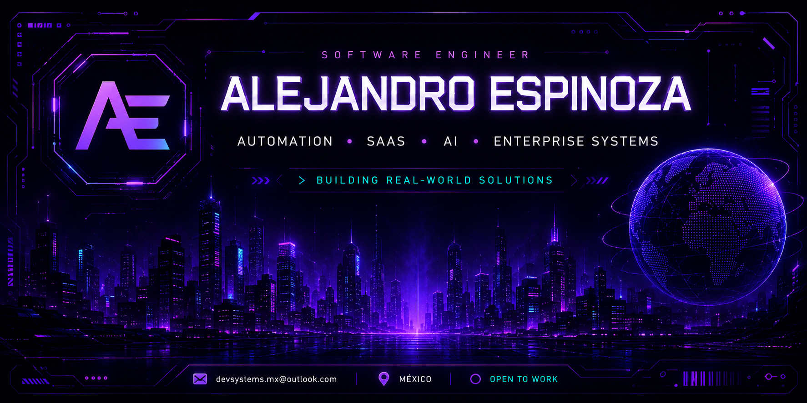
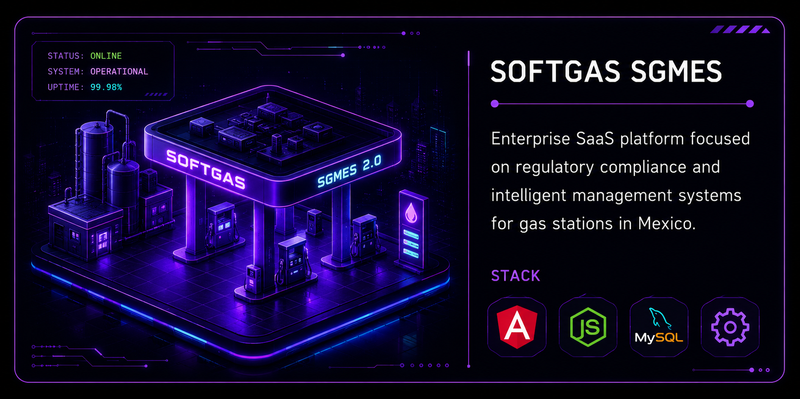
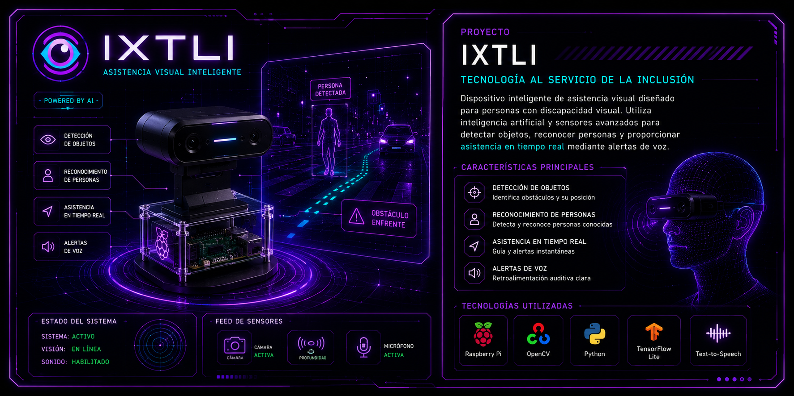
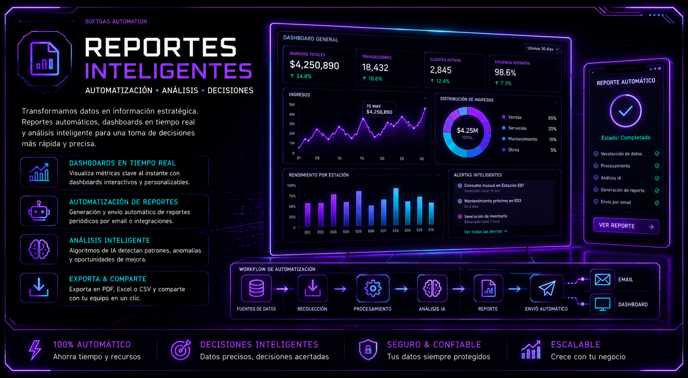

<div align="center">



<br/>


<br/>


</div>

---

#  SYSTEM PROFILE

<div align="center">

```yaml
name: Alejandro Espinoza

role: Software Engineer

specialized_in:
  - Artificial Intelligence
  - Automation Systems
  - SaaS Platforms
  - Enterprise Software
  - Backend Architecture

currently_building:
  - Intelligent Automation Systems
  - Regulatory Platforms
  - AI Solutions
  - Electoral Analytics Systems

status: ONLINE
```

</div>

---

#  TECH ECOSYSTEM

<div align="center">


</div>

<br/>

<div align="center">


</div>

---

#  FEATURED PROJECTS

<div align="center">

<table>
<tr>

<td width="50%">



</td>

<td width="50%">

## 🛢️ SOFTGAS SGMES

Enterprise SaaS platform focused on regulatory compliance and intelligent management systems for gas stations in Mexico.

#### STACK
`Angular` `Node.js` `MySQL` `Automation`

</td>

</tr>
</table>

</div>

---

<div align="center">

<table>
<tr>

<td width="50%">

## 🧠 IXTLI

AI-powered intelligent assistant designed for visually impaired people using sensors and real-time processing.

#### STACK
`Raspberry Pi` `AI` `Sensors`

</td>

<td width="50%">



</td>

</tr>
</table>

</div>

---

<div align="center">

<table>
<tr>

<td width="50%">



</td>

<td width="50%">

## 📊 REPORT AUTOMATION

Automated platform for digital report generation and enterprise workflow optimization.

#### STACK
`Automation` `Backend` `APIs`

</td>

</tr>
</table>

</div>

---

#  GITHUB ANALYTICS

<div align="center">


</div>

<br/>

<div align="center">


</div>

---

#  ACTIVITY MATRIX

<div align="center">


</div>

---

#  CURRENT OBJECTIVES

```typescript
const alejandro = {

  focus: "Enterprise AI & Automation",

  goals: [
    "Build scalable SaaS platforms",
    "Integrate AI into real-world systems",
    "Design enterprise architectures",
    "Master cloud infrastructure",
    "Automate critical business processes"
  ],

  status: "OPEN TO WORK"
};
```

---

#  CONNECT

<div align="center">

<a href="mailto:devsystems.mx@outlook.com">

</a>

<a href="https://github.com/aleespinozadev-oss">

</a>

</div>

<br/>

<div align="center">


<br/>
<br/>


</div>
